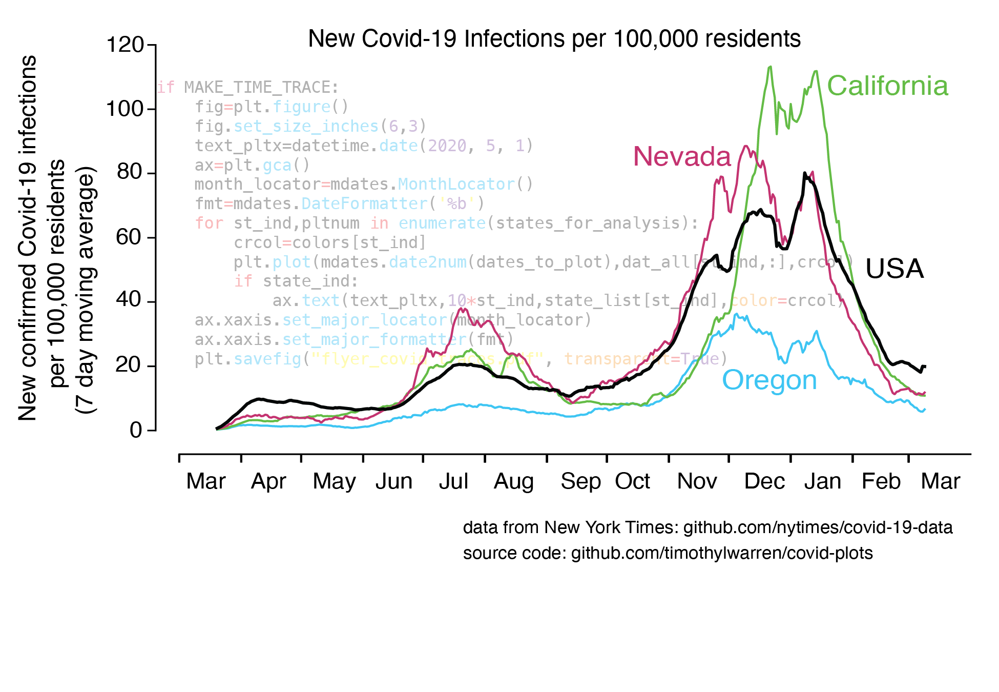

## Fall 2024
### Lecture: Tu/Th 10-11:20, ALS 4000
### Recitation: Weds 3-4:30, Cordley 2602

### Course Description
 <!---
  will replace this image
  
-->
 
 
 Develops competency in scientific computing and data analysis with broad applications to the life sciences. Introduces the Python programming language as a versatile, powerful tool for visualizing and analyzing data and for performing reproducible research. Focuses on real-world datasets originating across the life sciences. Provides a foundation for future work in data-intensive disciplines.

   

### Instructor
      

Timothy Warren  
tim.warren AT oregonstate.edu         

### Teaching Assistants

Nate Davidson
davidson AT oregonstate.edu

Vini Karumuru
karumurv AT oregonstate.edu

### [Syllabus & Course Policies](./syllabus.md) 
### [Class notes](./lecture_notes/class_notes.pdf)

### Weekly Calendar  

|Date                                  | Topics                             |  Relevant Reading                     | Assignment                                 |
|:-----------------------------        |:--------------------------------- |:------------------------------------  |:----------------------                      |
| Week 0  09/28&nbsp; &nbsp; &nbsp;&nbsp;&nbsp;| Course Goals and Philosophy  Introduction to Unix Shell and Python &nbsp; &nbsp; &nbsp;| [Jupyter Notebook](https://www.e-education.psu.edu/geog489/node/2204)&nbsp; &nbsp; &nbsp;&nbsp; &nbsp;&nbsp; &nbsp;  &nbsp; &nbsp;  | HW 0   Due Fri 10/06 &nbsp; &nbsp; |
|        |                |         |            |
| Week 1   10/3, 10/5    | Working with the Unix Shell  |  [Unix Shell](https://swcarpentry.github.io/shell-novice/)   | HW 1   Due Fri 10/13  |
|     |    |     |      |
| Week 2   10/10, 10/12    | Python Fundamentals: Data types, Storing and accessing data, Making Plots  | [Class curriculum](https://swcarpentry.github.io/python-novice-inflammation/)     [General Python Reference](https://docs.python.org/3/reference/index.html)  [Python in Jup. Notebooks](http://mbakker7.github.io/exploratory_computing_with_python/)                                       | HW 2   Due Fri 10/20|
|     |    |     |      |
| Week 3   10/17, 10/19    |Repeating actions with for loops | [for loops](https://swcarpentry.github.io/python-novice-inflammation/05-loop/index.html)     | HW 3   Due Fri 10/27|
|     |    |     | |
| Week 4   10/24, 10/26    | Defining functions, Making Choices and conditional statements, While loops  |[defining functions](https://swcarpentry.github.io/python-novice-inflammation/08-func/index.html)   | HW 4   Due Fri 11/03 |
|     |    |     |      |
|  Week 5   10/31, 11/02   | Data Visualization|[matplotlib example plots](https://matplotlib.org/stable/gallery/index.html)  [axis handles](https://matplotlib.org/stable/api/axes_api.html)|   HW 5   Due Mon 11/13 |
|     |    |     |      |
| Week 6    11/07, 11/09    | Data Visualization continued   *In-class quiz, Tu 11/07*|    | HW 6   Due Weds 11/22 |
|     |    |     |      |
| Week 7   11/14, 11/16    | Data visualization, Python Dictionaries |  [dictionary reference](https://www.greenteapress.com/thinkpython2/html/thinkpython2012.html)            | |
|     |    |     |      |
| Week 8   *11/21 (Zoom)*  |Dictionaries continued | [Dictionaries](https://www.greenteapress.com/thinkpython2/html/thinkpython2012.html)                                               | HW 7  Due Fri 12/1  |
|     |    |     |      |
| Week 9   11/28,11/30   |Writing Command-line Python scripts| [file input and output tutorial](https://datacarpentry.org/python-socialsci/05-processing-data-from-file/index.html) | HW 8   Due Tue 12/11|                              
|     |    |     |      |
| Week 10   12/05, 12/07   | Synthesis.  |                         | |

