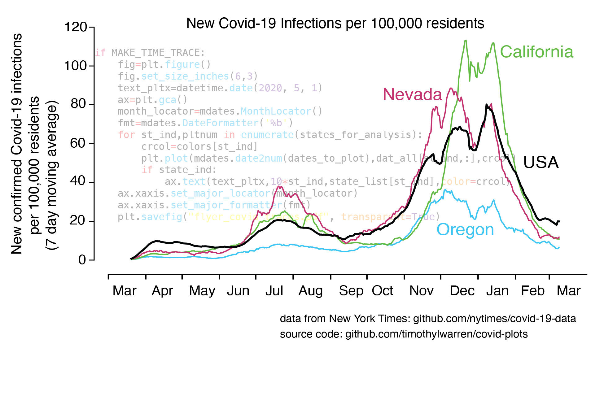
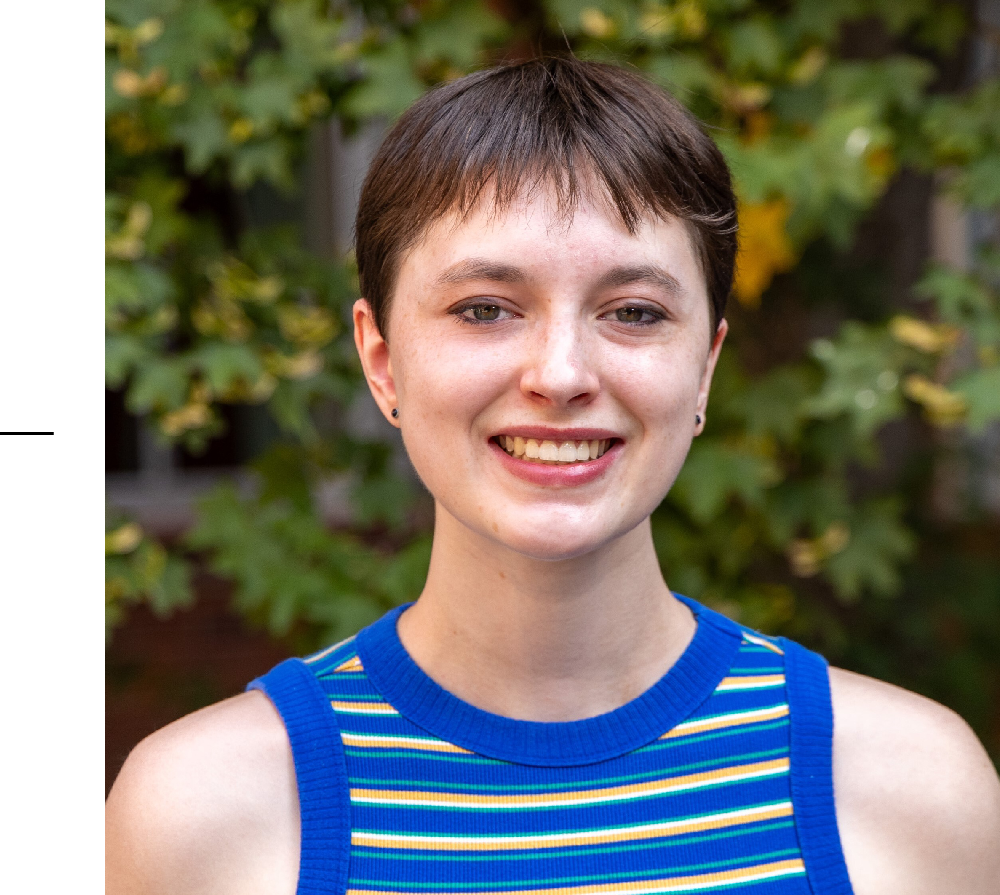

## Fall 2025
### Lecture: Tuesday/Thursday 10:00-11:20am, ALS 4000
[Campus map](https://map.oregonstate.edu/?building=ALS)

### Recitation Sections: (1) Wednesday 1-2:30, (2) 3:00-4:30pm, Cordley 2602 
  
[Campus map](https://map.oregonstate.edu/?building=Cord)

---

### Course Description
 <!---
  will replace this image
  
-->
 
 
 Develops competency in scientific computing and data analysis with broad applications to the life sciences. Introduces the Python programming language as a versatile, powerful tool for visualizing and analyzing data and for performing reproducible research. Focuses on real-world datasets originating across the life sciences. Provides a foundation for future work in data-intensive disciplines.

   

### [Syllabus & Course Policies](./syllabus.md) 
---
  
### Instructor
      

Timothy Warren  
tim.warren AT oregonstate.edu         

### Course Assistants

 <!-- First Row -->

  

     
    <strong>Andrea Schiffer (Head CA)</strong> 
    schiffan AT oregonstate.edu
  

     
    <strong>Steven Cai</strong> 
    caist AT oregonstate.edu
  

  

     
    <strong>Sarah Hoekema </strong> 
   hoekemas AT oregonstate.edu
  

  
  
  

  <!-- Second Row -->
  

     
    <strong>Morgan Miller</strong> 
    morgan.miller AT oregonstate.edu
  

  

     
    <strong>Imre Rist</strong> 
    risti AT oregonstate.edu
  

  
  

---
### Class notes
- ##### [Intro to Python](./class_notes/Intro_to_Python.html)
- ##### [Unix Shell](./class_notes/week1.html)
- ##### [Lists and Slicing](./class_notes/lists_slicing.html)
- ##### [Numpy](./class_notes/numpy.html)
- ##### [For Loops](./class_notes/for_loops.html)
- ##### [Conditional Statements and While Loops](./class_notes/conditionals.html)

<!--
- ##### [Python data types and indexing](./class_notes/week2.html) 
- ##### [For loops, appending to lists, and numpy commands](./class_notes/week3.html) 
- ##### [Function, nested loops, logic operators, if statements, in statements](./class_notes/week4.html) 
- ##### [Plotting with axes (labels and legends), np.diff, while loops](./class_notes/week5.html) 
- ##### [Subsetting arrays with conditionals, using np.argmax, np.argmin and np.argsort, creating subplots](./class_notes/week6.html) 
- ##### [Intro to dictionaries](./class_notes/week7.html) 
-->

---

### Weekly Calendar  

|Date                                  | Topics                             |  Relevant Reading                     | Assignment                                 |
|:-----------------------------        |:--------------------------------- |:------------------------------------  |:----------------------                      |
| Week 0  09/25&nbsp; &nbsp; &nbsp;&nbsp;&nbsp;| Course Goals and Philosophy  Introduction to Unix Shell and Python &nbsp; &nbsp; &nbsp;| [Jupyter Notebook](https://www.e-education.psu.edu/geog489/node/2204)&nbsp; &nbsp; &nbsp;&nbsp; &nbsp;&nbsp; &nbsp;  &nbsp; &nbsp;  | HW 0   Due Fri 10/03 &nbsp; &nbsp; |
|        |                |         |            |
| Week 1   9/30, 10/02    | Working with the Unix Shell  |  [Unix Shell](https://swcarpentry.github.io/shell-novice/)   | HW 1   Due Fri 10/10  |
|     |    |     |      |
| Week 2   10/07, 10/09    | Python Fundamentals: Data types, Storing and accessing data, Making Plots  | [Class curriculum](https://swcarpentry.github.io/python-novice-inflammation/)     [General Python Reference](https://docs.python.org/3/reference/index.html)  [Python in Jup. Notebooks](http://mbakker7.github.io/exploratory_computing_with_python/)                                       | HW 2   Due Fri 10/17|
|     |    |     |      |
| Week 3   10/14, 10/16    |Repeating actions with for loops | [for loops](https://swcarpentry.github.io/python-novice-inflammation/05-loop.html)     | HW 3   Due **Mon 10/27**|
|     |    |     | |
| Week 4   10/21, 10/23    | Making Choices and conditional statements  |   | **Quiz 1: 10/30** |
|     |    |     |      |
|  Week 5   10/28, 10/30 **Quiz**   | While Loops |  *In-class quiz, Th 10/30*|   HW 4   Due Fri 11/07 |
|     |    |     |      |
| Week 6    11/05, 11/07    | Functions |  [defining functions](https://swcarpentry.github.io/python-novice-inflammation/08-func/index.html)  | HW 5   Due Fri 11/14 |
|     |    |     |      |
| Week 7   Th 11/13    | Dictionaries |  [dictionary reference](https://www.greenteapress.com/thinkpython2/html/thinkpython2012.html)            |Quiz 2 11/26|
|     |    |     |      |
| Week 8   11/18, 11/20  |Data visualization & Quiz | [matplotlib example plots](https://matplotlib.org/stable/gallery/index.html)  [axis handles](https://matplotlib.org/stable/api/axes_api.html)      *In-class quiz, Th 11/20*                                         |   |
|     |    |     |      |
| Week 9   Tu 11/25    |Data Visualizion continued| [file input and output tutorial](https://datacarpentry.org/python-socialsci/05-processing-data-from-file/index.html) | HW 6   Due Weds 12/04|                              
|     |    |     |      |
| Week 10   12/03, 12/05   | Synthesis. Command-Line Scripts  |                         |HW 7   Due Weds 12/11 |

